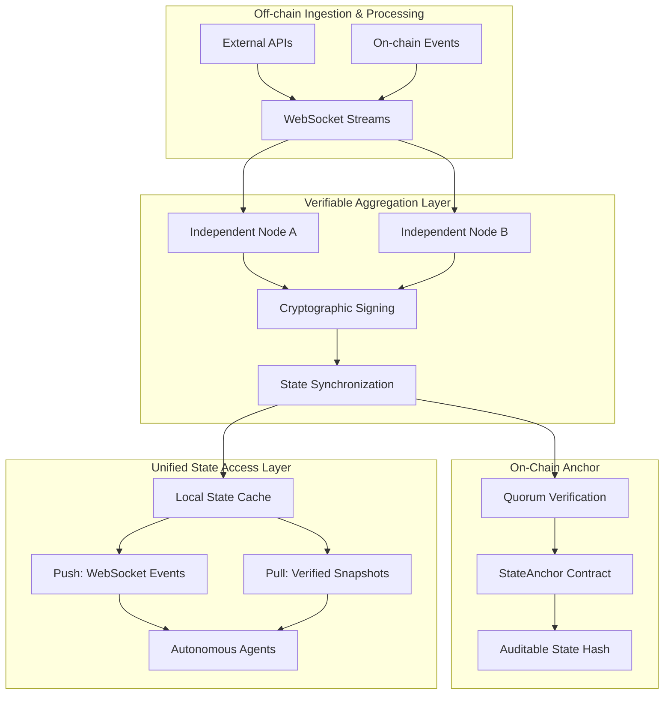

# Project: Verifiable Real-Time Data & State Access Layer for Autonomous Agents

## Overview
We are building a Verifiable Real-Time Data & State Access Layer for Autonomous Agents.

## Core Principles (Phase 1)
- **Minimal, Production-Grade Core**: Focus on sub-second data freshness, cryptographic verifiability, and a unified agent interface.
- **Hybrid Push-Pull Architecture**: 
    - **Push**: Continuous streaming of high-frequency data (e.g., asset prices, on-chain events) via heartbeat or deviation triggers.
    - **Pull**: On-demand queries returning the latest verified snapshots.
- **Primary Goal**: Establish a fast, reliable, and verifiable data pipeline to prevent agent hallucinations and stale state.

## System Architecture

The system is constructed as a real-time data pipeline composed of three tightly coupled layers:

1.  **Off-chain Ingestion & Processing Layer**: Handles continuous streaming of external and on-chain data into independent nodes. Assets and events are normalized in near real-time.
2.  **Cryptographically Verifiable Aggregation Layer**: 
    - **Quorum Mechanism**: Observations are signed by independent nodes (Ed25519) and aggregated once a majority is reached.
    - **Deterministic Aggregation**: Outlier-resistant functions (e.g., median) reconcile conflicting values from different sources/nodes.
    - **Merkle Accountability**: Aggregated states are hashed into Merkle trees, enabling compact proofs and verifiable audit trails for every state update.
3
1.  **Unified State Access Layer**: Exposed to autonomous agents, providing a seamless interface for both push-based event streams and pull-based state queries.
2.  **On-Chain Verification Anchor**: 
    - **Quorum Validation**: Minimal smart contracts verify that state updates have been signed by a majority of registered nodes.
    - **Freshness Proofs**: Enforces constraints to ensure the committed state is not older than a predefined window (e.g., 5 minutes) relative to block time.
    - **Commitment Storage**: Stores only the latest verified state hash (Merkle root), ensuring on-chain data remains compact and auditable.

### Core Architecture Principles
- **Stream Convergence**: Data flows are implemented using event-driven streams over WebSockets. Updates are triggered by either fixed time intervals (heartbeats) or deviation thresholds.
- **Node-Local State Cache**: Each node maintains a local state cache representing the most recent snapshot of all tracked assets. This ensures that both push and pull requests reference the exact same internal state representation.
- **Independent Synchronization**: Nodes operate independently to normalize and sign data, synchronizing state to maintain a high-integrity, distributed ledger of real-time events.
- **Minimal On-Chain Footprint**: Verification anchors use ECDSA signatures and block-time comparisons to provide cryptographic guarantees without the overhead of full data storage.

### Data Flow Overview

