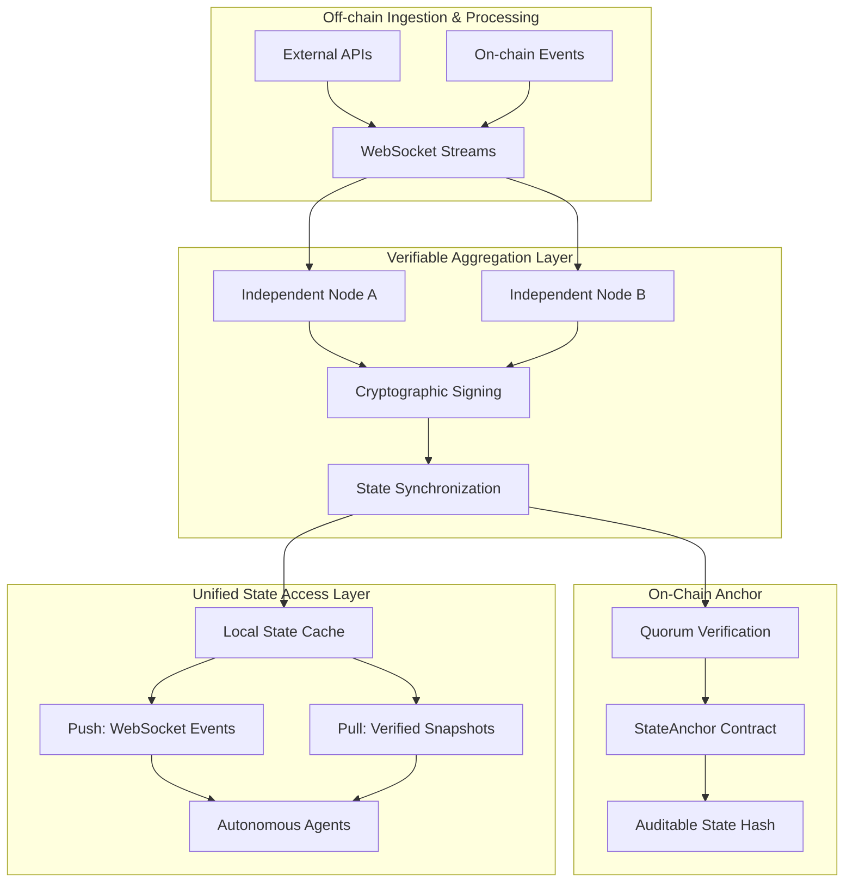

# Project: Verifiable Real-Time Data & State Access Layer for Autonomous Agents

## Overview
We are building a Verifiable Real-Time Data & State Access Layer for Autonomous Agents.

## Core Principles (Phase 1)
- **Minimal, Production-Grade Core**: Focus on sub-second data freshness, cryptographic verifiability, and a unified agent interface.
- **Hybrid Push-Pull Architecture**: 
    - **Push**: Continuous streaming of high-frequency data via heartbeat or deviation triggers.
    - **Pull**: On-demand queries returning the latest verified snapshots.
- **Protocol Evolution (Phase 3)**: Establish a decentralized, permissionless global state layer with multi-data type support and cross-chain verification.

## System Architecture

The system is constructed as a real-time data pipeline composed of three tightly coupled layers:

1.  **Off-chain Ingestion & Processing Layer**: Handles continuous streaming of external and on-chain data into independent nodes. Assets and events are normalized in near real-time.
2.  **Cryptographically Verifiable Aggregation Layer**: 
    - **Quorum Mechanism**: Observations are signed by independent nodes (Ed25519) and aggregated once a majority is reached.
    - **Deterministic & Generalized Aggregation**: Supports heterogeneous data (numbers via median, objects/strings via mode consensus).
    - **Merkle Accountability**: Aggregated states are hashed into Merkle trees, enabling compact proofs and cross-chain verification.
3
1.  **Unified State Access Layer**: Exposed to autonomous agents, providing a seamless interface for both push-based event streams and pull-based state queries.
2.  **On-Chain Verification Anchor**: 
    - **Quorum Validation**: Minimal smart contracts verify that state updates have been signed by a majority of registered nodes.
    - **Freshness Proofs**: Enforces constraints to ensure the committed state is not older than a predefined window (e.g., 5 minutes) relative to block time.
    - **Commitment Storage**: Stores only the latest verified state hash (Merkle root), ensuring on-chain data remains compact and auditable.

### Core Architecture Principles
- **Stream Convergence**: Data flows are implemented using event-driven streams over WebSockets. Updates are triggered by either fixed time intervals (heartbeats) or deviation thresholds.
- **Node-Local State Cache**: Each node maintains a local state cache representing the most recent snapshot of all tracked assets. This ensures that both push and pull requests reference the exact same internal state representation.
- **Independent Synchronization**: Nodes operate independently to normalize and sign data, synchronizing state to maintain a high-integrity, distributed ledger of real-time events.
- **Minimal On-Chain Footprint**: Verification anchors use ECDSA signatures and block-time comparisons to provide cryptographic guarantees without the overhead of full data storage.

### Data Flow Overview


### Unified API System (Implemented)
The access layer is implemented as a high-performance Rust service using `axum`. It provides:

- **RESTful State Queries**:
  - `GET /state`: Returns the full latest verified quorum snapshot including Merkle root and node signatures.
  - `GET /state/:key`: Returns a specific asset value along with a Merkle inclusion proof for independent verification by the agent.
- **Real-Time WebSocket Streaming**:
  - `WS /ws`: A persistent channel that broadcasts new `QuorumSnapshot` objects every time a consensus epoch is reached.
- **Cryptographic Verification**:
  - Each response includes the `proof` field, containing the Merkle proof and node signatures, allowing agents to verify the data against the on-chain anchor or known node public keys.

### Standardized Schema Example
```json
{
  "key": "ETH/USD",
  "value": 2510.42,
  "proof": {
    "merkle_root": "a1b2...",
    "proof_bytes": "f3e1...",
    "index": 0,
    "total_leaves": 1,
    "signatures": ["sig1...", "sig2..."]
  }
}
```

## Reliability & Resilience Layer (Implemented)
To ensure system integrity under stress, we have implemented a continuous testing and adversarial simulation framework:

- **Chaos Engineering & Fault Injection**:
  - **Latency Simulation**: Nodes can be configured to simulate network latency variance, injecting delays into data ingestion and consensus propagation.
  - **Data Corruption**: Adversarial nodes can inject corrupted or outlier data to test the robustness of the quorum mechanism and deterministic aggregation (slashing).
- **Stress Testing (Load Generation)**:
  - **High-Frequency Simulation**: Capable of simulating thousands of concurrent agent requests to measure end-to-end latency from ingestion to verified state output.
  - **Throughput Analysis**: Real-time measurement of request per second (RPS) and latency percentiles to identify bottlenecks.
- **Dynamic Adversarial Controls**: 
  - Exposed via `/simulation/chaos` and `/simulation/load` endpoints for real-time adjustments and performance profiling without restarting the network.

## Deployment Strategy & Phased Rollout
In order to deploy the system, we implement a phased rollout designed to validate correctness and latency at each step before increasing decentralization:

1.  **Phase 1: Single-Chain Semi-Trusted Cluster**:
    - Focus: Real-time data feed processing through a limited set of semi-trusted nodes.
    - Goal: Validate core ingestion latency and deterministic aggregation accuracy in a controlled environment.
2.  **Phase 2: Multi-Node Quorum & On-Chain Enforcement**:
    - Focus: Extending to a distributed multi-node quorum architecture.
    - Goal: Implement on-chain verification enforcement where state updates must be backed by cryptographic proofs of majority agreement.
3.  **Phase 3: Decentralized Protocol Network (Active)**:
    - **Focus**: Introduction of staking, slashing, and **permissionless participation**.
    - **Generalized State**: Support for arbitrary JSON schemas, moving beyond simple price feeds to complex state transitions.
    - **Cross-Chain Commitments**: Implementation of cryptographic state commitments for query-verify-act loops across heterogeneous environments.
